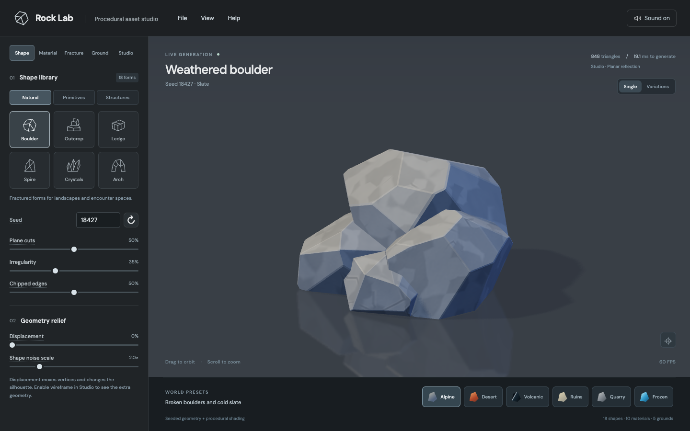

# Rock Lab

**Shape it. Shade it. Break it.** A procedural 3D asset studio that runs in your browser.

[**Open Rock Lab →**](https://smithmw7.github.io/rock-lab/) · [Try tap destruction](https://smithmw7.github.io/rock-lab/?fracture=1) · [User guide](docs/USER-GUIDE.md)

[](https://github.com/smithmw7/rock-lab/actions/workflows/pages.yml)
[](LICENSE)

[](https://smithmw7.github.io/rock-lab/)

Build a rock formation, turn it into quartz, set it on wet asphalt, and tap to fracture it. Every shape is generated from a seed. Materials, surface detail, lighting, and reflections respond live. No account or upload is needed to start.

## Explore the studio

| | What's inside |
| :--- | :--- |
| **Scene builder** | Multiple independent instances, selection, move/rotate/scale handles, snapping, and shaded/wireframe/collider/normal views |
| **8 scene examples** | Editable landscapes, ruins, workshops, and courtyards with rendered previews in the Gallery |
| **79 objects** | Rocks, terrain, modular architecture, furniture, tools, metal stock, pottery, and paths in a searchable scrolling library |
| **Terrain kit** | 16 cliffs, rock pillars, flat platforms, and stone ramps using the original material system |
| **Spline paths** | Editable stepping stones, fitted bricks and cobbles, wooden planks, or any of 74 source objects |
| **25 materials** | Stone and ice, glass and crystal, eight metals, three woods, and four ceramic finishes |
| **Composite tools** | Four hammer heads, three knife blades, and a hatchet with separate handle, working end, and fitting materials |
| **Spline lathe** | Drag six profile points to reshape bowls, vases, jars, urns, planters, saucers, goblets, and candlesticks |
| **5 grounds** | Studio, wet asphalt, concrete, sand, and wooden planks, with live planar reflections |
| **Surface detail** | Seeded noise, normal relief, grain, cracks, contrast, snow, and geometry displacement |
| **Optical effects** | Transmission, refraction, dispersion, absorption, cloudy volumes, and inclusions |
| **Tap destruction** | Voronoi, random planes, and slicing through [three-pinata](https://github.com/dgreenheck/three-pinata), with Rapier debris physics |
| **Independent cut faces** | Separate outer and inner materials, with live controls for both |
| **Sound** | Original procedural break and impact sounds for stone, concrete, glass, and wood |

## A quick first session

1. Open **Gallery** beside the Object / Scene switch to start with a complete editable scene, or browse the scrolling **Shape** library to create one object. Use **All**, a category, or search, then change the seed to generate variations.
2. Open **Material** to adjust the finish. **Outer / Inner** selects the original skin or exposed fracture faces.
3. Try **Ground → Wet asphalt**, then adjust roughness, normal strength, and puddle ripples.
4. Enable **Fracture → Tap destruction** and click the asset. Drag to orbit; scroll or pinch to zoom.
5. Switch **Object → Scene** at the top center to assemble multiple objects. Choose shapes to add them, then use the transform toolbar or numeric inspector.
6. Use **File → Save recipe / Save scene** to keep your settings, or **File → Save image** for a PNG.

Parameter labels have explanations on hover, keyboard focus, and touch. Action buttons stay free of tooltips. **View** contains framing, variations, turntable, and wireframe; **Help** contains the controls guide.

## Start from a scene

The **Gallery** is available in both Object and Scene modes. Choose a thumbnail to load its arrangement with independent objects, materials, lighting, and ground. Examples open with the Move tool active: click an object to select it, then drag a gizmo axis. Use Rotate, Scale, or the numeric Scene inspector for further edits. Geometry parameter controls and Material edit the selected object; clicking a shape card adds a new object to the scene.

| Example | Starting point |
| :--- | :--- |
| **Alpine crossing** | A stone bridge, snowy banks, lookout ledge, and icy outcrop |
| **Redrock canyon** | Layered desert cliffs, a sandstone gateway, and stepping stones |
| **Coastal ruins** | Pale shoreline masonry, broken columns, and turquoise relics |
| **Crystal hollow** | Quartz and glacier formations around a dark stone hollow |
| **Basalt forge** | A volcanic workshop with an anvil, timber bench, and metal tools |
| **Quarry yard** | Cut blocks, unfinished columns, and a working ramp |
| **Artisan terrace** | A pottery workshop with a table, glazed vessels, and display platform |
| **Garden courtyard** | A garden arch, stepped paving, celadon vessels, and wooden seating |

The first gallery load keeps one backup of your previous workspace for this page session. Loading other examples or importing recipe JSON does not replace that backup. Open **Gallery → Restore previous scene** to return to the saved workspace, including its Object draft or Scene arrangement and viewing context. Restoring consumes the backup; the next gallery load can keep a new one.

## Run locally

Use Node.js 22.12+ or Node.js 24.

```sh
git clone https://github.com/smithmw7/rock-lab.git
cd rock-lab
npm ci
npm run dev -- --port 5207
```

Open [localhost:5207](http://127.0.0.1:5207/). Choose another free port if it is in use. A recent browser with WebGL2 is required. Fracture physics loads when you enable destruction.

```sh
npm run verify                 # Seeded geometry and material checks
npm run verify:kit             # Closed meshes across kit parameter extremes
npm run verify:workshop        # Tool variants, hollow vessels, and spline extremes
npm run verify:terrain         # Closed terrain meshes and actual fracture
npm run verify:paths           # Fitted paving, spacing, world scale, and budgets
npm run verify:fracture        # Actual fracture geometry and physics
npm run verify:scene           # Scene ownership, transforms, convex hulls, and budgets
npm run verify:scene-presets   # Validate all eight editable example scenes
npm run qa:scene               # Real browser scene editing and recipe checks
npm run qa:scene-gallery       # Gallery loading, restore, and recipe round trips
npm run render:scene-gallery   # Regenerate the example thumbnail images
npm run build                 # Portable static app in dist/
npm run verify:publication     # Check deployable assets and exclusions
npm run preview -- --port 5208
```

The GitHub Actions workflow builds and deploys `main` to Pages. Relative asset paths support project sites and forks. When forking, enable **Settings → Pages → GitHub Actions** and update the README/social URLs for your fork.

## Export and reuse

**Available today:** recipe JSON and viewport PNG. Recipes restore the intact source with geometry, independent materials, lighting, ground, and fracture settings. Recipes now use version 6. Scene files preserve independent object recipes, names, transforms, selection, snapping, display settings, and the scene environment, alongside the original Object draft. Scenes started in the Gallery also retain their preset identity when saved and imported, including your edits. The temporary gallery backup, moving debris, and camera position are not serialized. Versions 1–5 still load into Object mode.

**Not yet implemented:** GLB export, UV atlasing, and baked PBR texture export. Normal/height/roughness views are shader diagnostics. They are not downloadable game texture maps.

Start with [`src/geometry.js`](src/geometry.js), [`src/material.js`](src/material.js), [`src/ground.js`](src/ground.js), and [`src/fracture.js`](src/fracture.js) to reuse the generators in another Three.js project. The [full guide](docs/USER-GUIDE.md) explains the controls, integration, rendering tradeoffs, and game-asset pipeline.

- [Glass, crystal, and ice shader research](TRANSLUCENT-MATERIALS.md)
- [Object library: all 79 forms](docs/OBJECT-LIBRARY.md)
- [Composite tools, materials, and spline lathe guide](docs/WORKSHOP.md)
- [Terrain and editable spline paths](docs/PATHS.md)
- [Scene building and transform tools](docs/SCENE.md)
- [Stylized wood research and pipeline](STYLIZED-WOOD-RESEARCH.md)
- [Validation notes](VALIDATION.md)
- [Contributor rules](AGENTS.md)

## Credits and license

Created by Marshall Smith. Application code and the original synthesized sound bank are [MIT licensed](LICENSE). Built with Three.js, three-pinata, and Rapier; their licenses remain applicable. See [third-party notices](THIRD_PARTY_NOTICES.md).

The public repository and Pages build exclude private commercial recordings and reference artwork. Optional locally licensed audio is documented separately in [the audio guide](docs/AUDIO.md).
